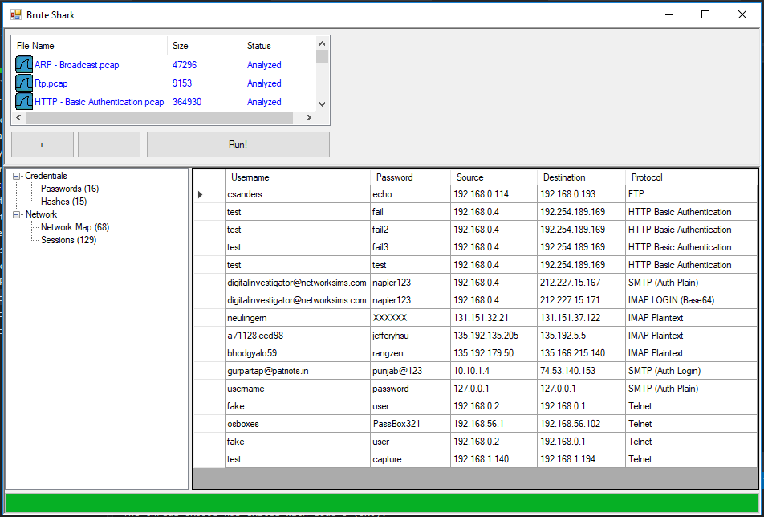
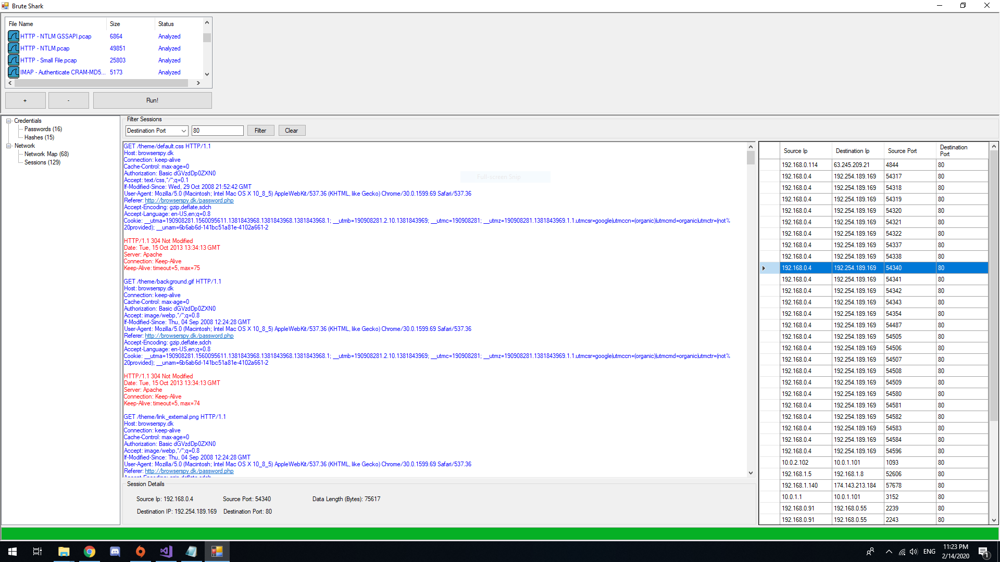
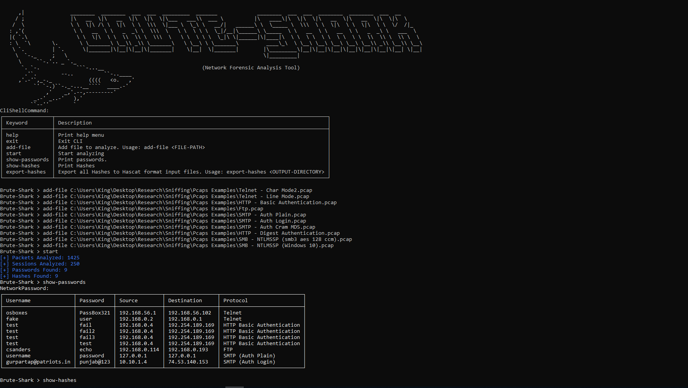

# Brute Shark

BruteShark is a Network Forensic Analysis Tool (NFAT) that performs deep processing and inspection of network traffic (mainly PCAP files). It includes: password extracting, building a network map, reconstruct TCP sessions, extract hashes of encrypted passwords and even convert them to a Hashcat format in order to perform an offline Brute Force attack.

The main goal of the project is to provide solution to security researchers and network administrators with the task of network traffic analysis while they try to identify weaknesses that can be used by a potential attacker to gain access to critical points on the network.

Two BruteShark versions are available, A GUI based application (Windows) and a Command Line Interface tool (Windows and Linux).  
The various projects in the solution can also be used independently as infrastructure for analyzing network traffic on Linux or Windows machines. For further details see the Architecture section.

The project was developed in my spare time to address two main passions of mine: software architecture and analyzing network data.

Contact me on <contact.oded.shimon@gmail.com> or [create new issue](https://github.com/odedshimon/BruteShark/issues).

## What it can do
* Extracting and encoding usernames and passwords (HTTP, FTP, Telnet, IMAP, SMTP...)
* Extract authentication hashes and crack them using Hashcat (Kerberos, NTLM, CRAM-MD5, HTTP-Digest...)
* Build visual network diagram
* Reconstruct all TCP Sessions

## Download
* Windows - download [Windows Installer (64 Bit)](https://github.com/odedshimon/BruteShark/releases/latest/download/BruteSharkDesktopInstaller_x64.msi).
* Linux - download [BruteSharkCli.zip](https://github.com/odedshimon/BruteShark/releases/latest/download/BruteSharkCli.zip) and run BruteSharkCli.exe using MONO:
```bash
wget https://github.com/odedshimon/BruteShark/releases/latest/download/BruteSharkCli.zip
unzip BruteSharkCli.zip 
mono BruteSharkCli/BruteSharkCli.exe
```

# Examples
##### Videos
[**How do i crack (by mistake!) Windows 10 user NTLM password**](https://youtu.be/AreguLxCCz4)  
[**Run Brute Shark CLI on Ubuntu with Mono**](https://youtu.be/am1xU_kAxiI)  
##### Hashes Extracting

##### Password Extracting

##### Building a Network Diagram

##### Reconstruct all TCP Sessions

##### Brute Shark CLI 


# Architecture
The solution is designed with three layer architecture, including a one or more projects at each layer - DAL, BLL and PL.
The separation between layers is created by the fact that each project refers only its own objects.
##### PcapProcessor (DAL)
As the Data Access Layer, this project is responsible for reading raw PCAP files using appropriate drivers (WinPcap, libpcap) and their wrapper library SharpPcap.
Can analyze a list of files at once, and provides additional features like reconstruction of all TCP Sessions (using the awesome project TcpRecon).
##### PcapAnalyzer (BLL)
The Business Logic Layer, responsible for analyzing network information (packet, TCP Session etc.), implements a pluggable mechanism.
Each plugin is basically a class that implements the interface *IModule*. All plugins are loaded using reflection:
```csharp
private void _initilyzeModulesList()
{
    // Create an instance for any available modules by looking for every class that 
    // implements IModule.
    this._modules = AppDomain.CurrentDomain.GetAssemblies()
                    .SelectMany(s => s.GetTypes())
                    .Where(p => typeof(IModule).IsAssignableFrom(p) && !p.IsInterface)
                    .Select(t => (IModule)Activator.CreateInstance(t))
                    .ToList();

    // Register to each module event.
    foreach(var m in _modules)
    {
        m.ParsedItemDetected += (s, e) => this.ParsedItemDetected(s, e);
    }
    
}
```
##### BruteSharkDesktop (PL)
Desktop application for Windows based on WinForms.
Uses a cross-cutting project by the meaning it referrers both the DAL and BLL layers.
This is done by composing each of the layers, register to their events, when event is triggered, cast the event object to the next layer equivalent object, and send it to next layer.
```csharp
public MainForm()
{
    InitializeComponent();

    _files = new HashSet<string>();

    // Create the DAL and BLL objects.
    _processor = new PcapProcessor.Processor();
    _analyzer = new PcapAnalyzer.Analyzer();
    _processor.BuildTcpSessions = true;

    // Create the user controls. 
    _networkMapUserControl = new NetworkMapUserControl();
    _networkMapUserControl.Dock = DockStyle.Fill;
    _sessionsExplorerUserControl = new SessionsExplorerUserControl();
    _sessionsExplorerUserControl.Dock = DockStyle.Fill;
    _hashesUserControl = new HashesUserControl();
    _hashesUserControl.Dock = DockStyle.Fill;
    _passwordsUserControl = new GenericTableUserControl();
    _passwordsUserControl.Dock = DockStyle.Fill;

    // Contract the events.
    _processor.TcpPacketArived += (s, e) => _analyzer.Analyze(Casting.CastProcessorTcpPacketToAnalyzerTcpPacket(e.Packet));
    _processor.TcpSessionArived += (s, e) => _analyzer.Analyze(Casting.CastProcessorTcpSessionToAnalyzerTcpSession(e.TcpSession));
    _processor.FileProcessingStarted += (s, e) => SwitchToMainThreadContext(() => OnFileProcessStart(s, e));
    _processor.FileProcessingEnded += (s, e) => SwitchToMainThreadContext(() => OnFileProcessEnd(s, e));
    _processor.ProcessingPrecentsChanged += (s, e) => SwitchToMainThreadContext(() => OnProcessingPrecentsChanged(s, e));
    _analyzer.ParsedItemDetected += (s, e) => SwitchToMainThreadContext(() => OnParsedItemDetected(s, e));
    _processor.TcpSessionArived += (s, e) => SwitchToMainThreadContext(() => OnSessionArived(Casting.CastProcessorTcpSessionToBruteSharkDesktopTcpSession(e.TcpSession)));
    _processor.ProcessingFinished += (s, e) => SwitchToMainThreadContext(() => OnProcessingFinished(s, e));

    InitilizeFilesIconsList();
    this.modulesTreeView.ExpandAll();
}
```
##### BruteSharkCLI (PL)
Command Line Interface version of Brute Shark.
Cross platform Windows and Linux (with Mono).
Available commands: 
(1). help  
(2). add-file  
(3). start  
(4). show-passwords  
(5). show-hashes  
(6). export-hashes  
(7). exit 